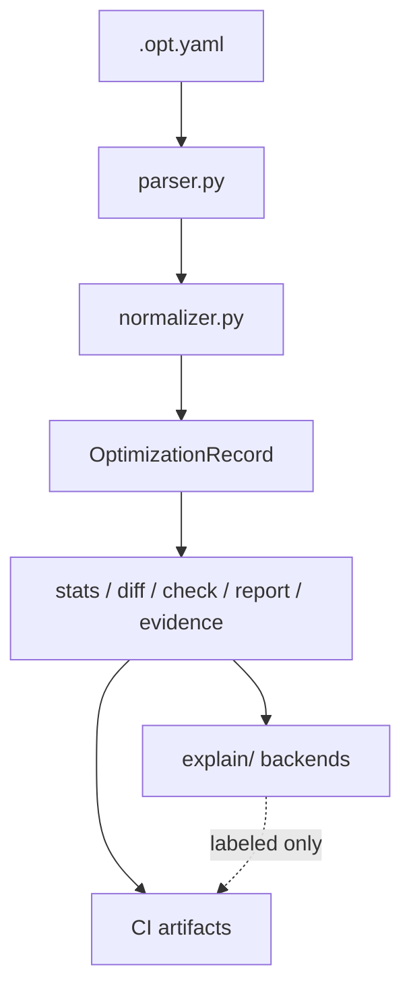

# explncc architecture

Chapter 13: *Inside explncc — from optimization logs to compiler-semantic infrastructure*.

## Core invariant

**Only explanation backends are nondeterministic.** Everything before that — parse, normalize, stats, diff, checks, reports, evidence packs, digests — must be reproducible, testable, cacheable, and CI-safe.

## Pipeline

```text
.opt.yaml
  → parser (preserve YAML tags + raw documents)
  → normalizer → OptimizationRecord (+ stable identity hashes)
  → deterministic analysis (summary, stats, diff, check, report, evidence)
  → optional explain (rule / ollama / openai / claude / auto)
  → artifacts (Markdown, JSON, HTML, GitHub)
```



## Module responsibilities

| Module | Role |
|--------|------|
| `parser.py` | YAML stream loader; preserves `!Missed` / `!Passed` / `!Analysis` |
| `normalizer.py` | Raw document → `OptimizationRecord` |
| `record_identity.py` | `record_id`, `record_hash`, `raw_hash`, keys |
| `models.py` | Pydantic schema |
| `evidence.py` | EvidencePack (model-facing unit) |
| `context_snippets.py` | Optional source / IR / asm leaves |
| `stats.py`, `diffing.py`, `checks.py` | Deterministic analysis |
| `ci_report.py`, `html_report.py` | Report artifacts |
| `digest.py` | Cache keys over compiler evidence |
| `trace.py` | Pipeline visibility for teaching |
| `toolchains/` | Adapter boundary (Clang today) |
| `explain/` | Optional nondeterministic layer |
| `cli.py` | **Orchestration only** — parse flags, call modules |

## LST direction

explncc is not a full **Lossless Semantic Tree** implementation, but it follows the same direction: preserve source-linked compiler semantic facts and expose them as stable **evidence objects** (`EvidencePack`) with explicit `missing_context`.

See [chapter-10-notes.md](chapter-10-notes.md).

## Trust rules

1. **Compiler YAML is authoritative** — never replaced by model output.
2. **Backends consume normalized records or evidence packs** — never raw `.opt.yaml`.
3. **Policy gates** use deterministic counters only.
4. **Doctor / digest** never print raw API keys.

## Toolchain note

Default adapter: **Clang `.opt.yaml`** (`toolchains/clang.py`). Future: GCC fopt-info, MSVC diagnostics — see [toolchain-notes.md](toolchain-notes.md).
