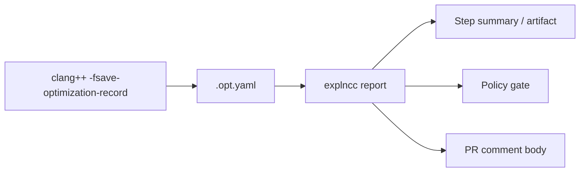
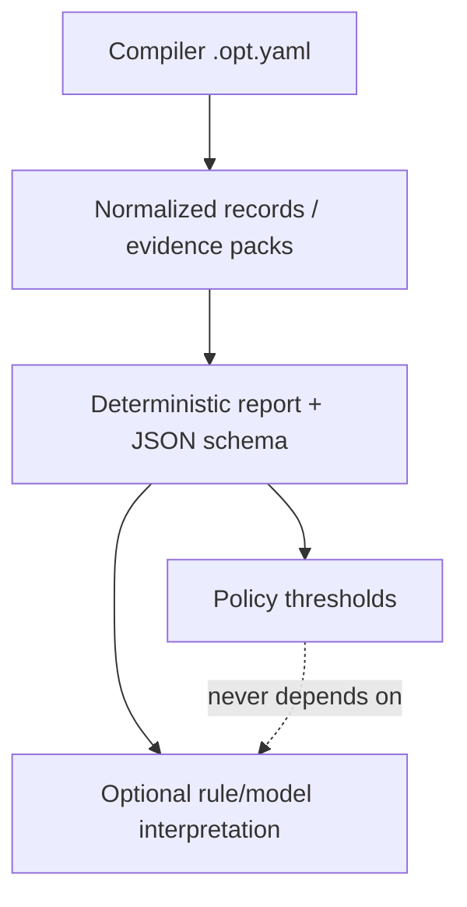
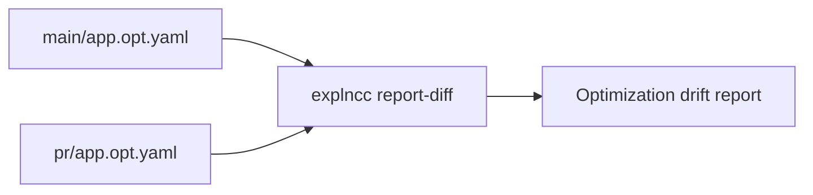

# Chapter 12 — Compiler Optimization CI Feedback Loop

*Adding an LLM Layer to Your Compiler CI* is not about asking a model to review raw compiler logs. The operating model is:

1. **Compiler YAML is authoritative** — the `.opt.yaml` from `-fsave-optimization-record` is evidence.
2. **CI organizes and preserves evidence** — artifacts, summaries, and semantic history across commits.
3. **Deterministic policy gates decide pass/fail** — counters and thresholds only; never model output.
4. **Models optionally help humans triage** — clearly labeled sections, offline-friendly defaults.

A single `.opt.yaml` is compiler evidence. A sequence of `.opt.yaml` files across commits is **compiler-semantic history** (complementing source diffs).

## Basic CI flow



## Trust stack



## Semantic CI history



## Where to intercept

Run `explncc` **after** compilation, when `.opt.yaml` exists:

```bash
clang++ -O3 -fsave-optimization-record \
  -foptimization-record-file=build/app.opt.yaml \
  app.cpp -o build/app
```

## Recommended operating model

| Cadence | Command pattern | Explanation |
|---------|-----------------|-------------|
| Every push | `report --format markdown --no-explain` | Fast, offline step summary |
| Every push | `report --format json` + upload artifact | Dashboards / bots |
| PR | `report --format github --top-missed 10` | Compact collapsible comment body |
| PR gate | `report --fail-on-check --max-missed-inline N` | Deterministic fail |
| PR semantic | `report-diff baseline pr --format github` | Compiler decision drift |
| Nightly | `report --explain-backend rule\|auto` | Richer triage when latency allows |

## Output formats

| Format | Use |
|--------|-----|
| `markdown` | GitHub `GITHUB_STEP_SUMMARY`, Jenkins archive, wiki |
| `json` | Stable schema (`schema_version`, `summary`, `policy`, `metadata`) |
| `github` | PR comment file (`<details>` sections); post with `gh pr comment --body-file` |

`explncc` **generates** comment bodies; it does not post to GitHub.

## JSON metadata (dashboards)

```bash
python -m explncc report build/app.opt.yaml \
  --format json \
  --no-explain \
  --git-sha "$GITHUB_SHA" \
  --branch "$GITHUB_REF_NAME" \
  --pr-number "$PR_NUMBER" \
  --build-id "$GITHUB_RUN_ID" \
  --ci-provider github \
  -o report.json
```

Missing metadata fields are `null` — not inferred unless you pass flags explicitly.

## Policy gates (deterministic only)

```bash
python -m explncc report build/app.opt.yaml \
  --format markdown \
  --fail-on-check \
  --max-missed-inline 80 \
  --max-missed-vectorize 20 \
  --max-total-missed 500 \
  -o gate.md
```

Thresholds: `--max-missed-inline`, `--max-missed-vectorize`, `--max-missed-unroll`, `--max-total-missed`, `--max-analysis`, `--max-missed-loop-vectorize`.

Model backends **must not** be the gate. If explanation runs on failure, it appears under **Optional triage notes**, not as the failure reason.

## Semantic diff across builds

```bash
python -m explncc report-diff \
  build/baseline/app.opt.yaml \
  build/pr/app.opt.yaml \
  --before-label main \
  --after-label pr \
  --format github \
  --top-changes 15 \
  -o pr-diff-comment.md
```

Classifies observed changes (regression / improvement / neutral) from compiler evidence only — no source-edit inference.

## Explanation safety

- Default: `--no-explain` (no network required).
- Backends consume **normalized records**, not raw YAML.
- `--explain-only-on-failure` for gated triage.
- `--strict-explain` fails the command if the backend errors; otherwise a warning is recorded and the deterministic report continues.

```bash
python -m explncc report build/app.opt.yaml \
  --format markdown \
  --fail-on-check \
  --max-missed-inline 80 \
  --explain-backend rule \
  --explain-only-on-failure \
  -o gate.md
```

## CI artifact manifest

```bash
python -m explncc report build/app.opt.yaml \
  --format markdown \
  -o report.md \
  --write-manifest manifest.json
```

Or assemble manually: `python -m explncc ci-manifest manifest.json --raw-opt-yaml build/app.opt.yaml --markdown-report report.md`

## Security, cost, latency

- Never log `OPENAI_API_KEY` or `ANTHROPIC_API_KEY`; use CI secrets.
- Reports may include source paths and compiler messages — treat artifacts as potentially sensitive.
- Use `--no-explain` on every push; enable models on nightly, labeled PRs, or `--explain-only-on-failure`.
- Deterministic `report` / `check` / `report-diff` work fully offline.

## Repository examples

| Path | Purpose |
|------|---------|
| `examples/ci/github-actions/explncc-report.yml` | Summary + JSON + PR comment artifact |
| `examples/ci/github-actions/explncc-gated.yml` | Deterministic gate, upload on failure |
| `examples/ci/github-actions/explncc-diff-pr.yml` | Baseline vs PR semantic diff |
| `examples/ci/jenkins/Jenkinsfile.snippet` | Archive Markdown + JSON + gate |
| `examples/ci/cron/run_nightly_report.sh` | Timestamped nightly archive |

See also [chapter-12-notes.md](chapter-12-notes.md) for a compact checklist.
